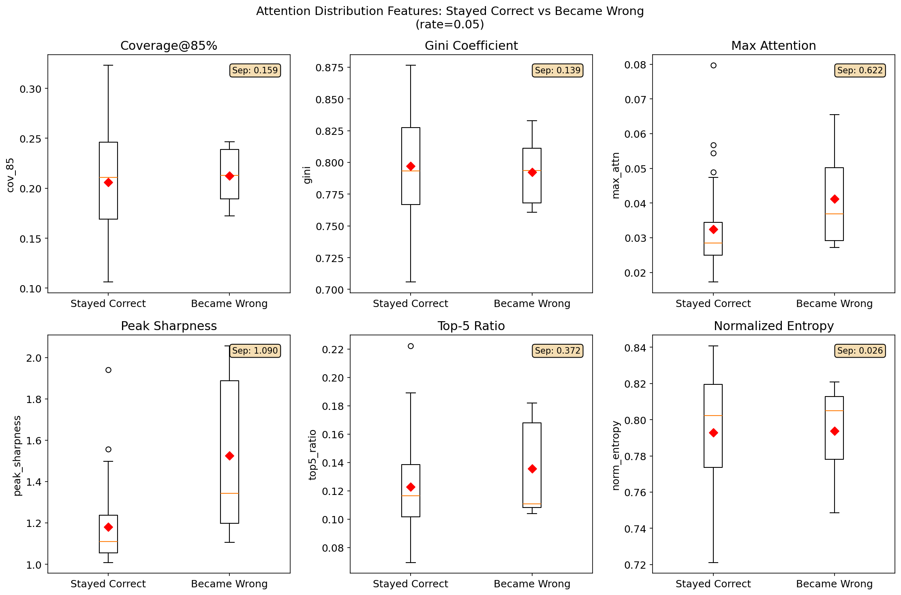
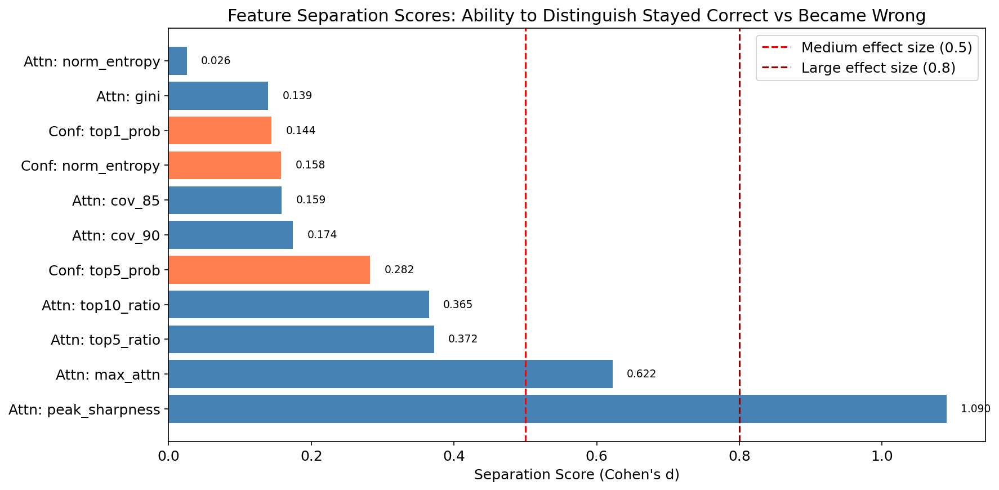
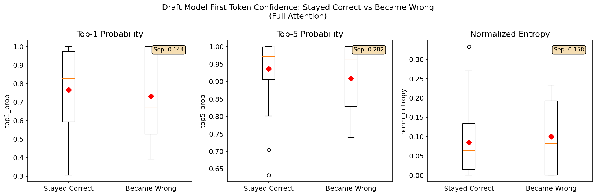

# DraftModel 动态重算比例分析报告

## 1. 背景与目标

### 1.1 问题背景

在 FusionRAG 的 DraftModel 方法中，我们使用小模型（Qwen2.5-3B）的 attention 分布来指导大模型（Qwen2.5-7B）的 token 选择和重算。当前方案使用**固定重算比例**（如 rate=0.3），但存在以下问题：

- 有些问题用 rate=0.05 就能答对
- 有些问题需要更高的 rate 才能答对
- 固定比例无法适应不同问题的需求

### 1.2 目标

探索一种**动态计算重算比例**的方法，能够：
- 对简单问题使用低 rate（节省计算）
- 对复杂问题使用高 rate（保证质量）

### 1.3 核心挑战

> **如何在不知道答案的情况下，判断当前问题需要多高的重算比例？**

---

## 2. 数据集与实验设置

### 2.1 数据来源

- **数据集**: result_reflect.json
- **模型**: Qwen2.5-7B-Instruct (主模型) + Qwen2.5-3B-Instruct (Draft模型)
- **测试结果**: DraftModel_global_topk_10_rate_0.05_revert_rope.csv

### 2.2 样本分类

基于 rate=1.0（完整重算）和 rate=0.05（5%重算）的测试结果，将样本分为四类：

| 类别 | rate=1.0 | rate=0.05 | 数量 | 说明 |
|------|----------|-----------|------|------|
| **stayed_correct** | ✓ 正确 | ✓ 正确 | 166 | 低 rate 足够 |
| **became_wrong** | ✓ 正确 | ✗ 错误 | 54 | 需要更高 rate |
| stayed_wrong | ✗ 错误 | ✗ 错误 | 20 | 无论如何都错 |
| became_correct | ✗ 错误 | ✓ 正确 | 10 | 特殊情况 |

**核心对比**: stayed_correct vs became_wrong

---

## 3. 尝试一：Attention 分布特征分析

### 3.1 假设

> 不同问题的 attention 分布特征可能不同，通过分析这些特征可以预测问题需要多高的重算比例。

### 3.2 分析的特征

| 特征 | 说明 |
|------|------|
| cov_85 | 达到 85% attention 覆盖需要的 token 比例 |
| cov_90 | 达到 90% attention 覆盖需要的 token 比例 |
| gini | Gini 系数，衡量 attention 集中度 |
| norm_entropy | 归一化熵，衡量 attention 分布的均匀程度 |
| max_attn | 单个 token 的最大 attention 值 |
| peak_sharpness | 最大值与第二大值的比值 |
| top5_ratio | Top-5 token 的 attention 占比 |
| top10_ratio | Top-10 token 的 attention 占比 |

### 3.3 结果

**样本量**: stayed_correct=35, became_wrong=7

| 特征 | Stayed Correct | Became Wrong | 分离度 |
|------|---------------|--------------|--------|
| cov_85 | 0.206 ± 0.052 | 0.213 ± 0.031 | **0.16** |
| gini | 0.797 ± 0.040 | 0.792 ± 0.029 | **0.14** |
| peak_sharpness | 1.179 ± 0.191 | 1.526 ± 0.407 | **1.09** |
| max_attn | 0.033 ± 0.013 | 0.041 ± 0.015 | **0.62** |
| top5_ratio | 0.123 ± 0.033 | 0.136 ± 0.035 | **0.37** |
| norm_entropy | 0.793 ± 0.034 | 0.794 ± 0.030 | **0.03** |

**分离度说明**: Cohen's d 值，< 0.5 为小效应，0.5-0.8 为中等效应，> 0.8 为大效应

### 3.4 可视化





### 3.5 结论

- **peak_sharpness (1.09)** 和 **max_attn (0.62)** 有一定区分度
- 但大部分特征的分离度很低（< 0.5）
- **Attention 分布特征无法可靠区分两组**

### 3.6 有趣发现

became_wrong 组的 attention 反而更**集中**（peak_sharpness 更高）：

| 问题 | 类别 | peak_sharpness | 特点 |
|------|------|----------------|------|
| Who is the child of Peter Andreas Heiberg? | became_wrong | 1.34 | 需要特定亲子关系 |
| When was King Henry III crowned? | became_wrong | 2.06 | 需要特定年份 |
| What network is National Cycle Route 57 part of? | stayed_correct | 1.14 | 答案多处提及 |
| Where is Coffee Swamp located? | stayed_correct | 1.08 | 位置信息分散 |

**解释**: 当 attention 非常集中在少数 token 时，如果这些 token 没被选中，就完全丢失关键信息。

---

## 4. 尝试二：Draft Model 首 Token 置信度

### 4.1 假设

> Draft model 在 Full Attention 下生成首 token 的置信度可能反映问题的"难度"，置信度低的问题可能需要更高的重算比例。

### 4.2 方法

1. Draft model (3B) 对完整输入做 Full Attention prefill
2. 获取最后位置的 logits
3. 计算首 token 的置信度指标：top1_prob, top5_prob, entropy

**优势**: 零额外开销（prefill 已经做了）

### 4.3 结果

**样本量**: stayed_correct=35, became_wrong=7

| 特征 | Stayed Correct | Became Wrong | 分离度 |
|------|---------------|--------------|--------|
| top1_prob | 0.767 ± 0.219 | 0.731 ± 0.273 | **0.14** |
| top5_prob | 0.936 ± 0.087 | 0.909 ± 0.108 | **0.28** |
| norm_entropy | 0.085 ± 0.081 | 0.100 ± 0.105 | **0.16** |

### 4.4 可视化



### 4.5 关键发现

**became_wrong 中有高置信度的案例**：

| 问题 | top1_prob | Draft首token | rate=0.05预测 |
|------|-----------|--------------|--------------|
| In which county is Pine Springs? | **0.999** | ' Cul' (Culberson) | Falls County ❌ |
| When was King Henry III crowned? | **1.000** | '1' | 1220 ❌ |
| Who is the sibling of Natalie Wood? | 0.672 | ' Lana' (正确) | Phylicia Rashad ❌ |

**关键洞察**:
- Draft model 在 Full Attention 下**知道正确答案**（首 token 是 'Cul'）
- 但 Main model 在低 rate 下却答错了（Falls County）

### 4.6 结论

> **Draft model 是 Full Attention，它的信号无法反映 Main model 在 Sparse Attention 下的行为。**

首 token 置信度**无法区分**需要高 rate 的问题。

---

## 5. 问题本质分析

### 5.1 信息断层

```
Draft Model (Full Attention)
    → 选择 top-k token
    → Main Model (Sparse Attention, 只看选中的 token)
```

我们试图用 **Full Attention 的信号** 来预测 **Sparse Attention 的效果**，这存在根本的信息断层。

### 5.2 错误案例分析

查看 became_wrong 的具体预测：

| 问题 | Ground Truth | rate=0.05 预测 | 问题类型 |
|------|-------------|----------------|---------|
| Who is the child of Peter Andreas Heiberg? | Johan Ludvig Heiberg | Sigrid Sture | 亲属关系 |
| Who is the sibling of Natalie Wood? | Lana Wood | Phylicia Rashad | 亲属关系 |
| In which county is Pine Springs? | Culberson County | Falls County | 地理位置 |
| Who is Empress Wang's husband? | Yang Pu | Fu Jiān | 历史人物 |

**共同特点**:
- 答案是文档中的**特定事实**
- 当关键 token 没被选中时，模型产生**幻觉**（编造一个看似合理但错误的答案）

### 5.3 stayed_correct 的特点

| 问题 | Ground Truth | rate=0.05 预测 |
|------|-------------|----------------|
| What network is National Cycle Route 57 part of? | National Cycle Network | National Cycle Network ✓ |
| Who is the physicist that Mach number is named after? | Ernst Mach | Ernst Mach ✓ |
| Who played King George VI in The King's Speech? | Colin Firth | Colin Firth ✓ |

**共同特点**:
- 答案可能在文档中**多处出现**
- 或者答案是**非常显著**的信息

---

## 6. 总结与下一步

### 6.1 尝试总结

| 方法 | 假设 | 结果 | 问题 |
|------|------|------|------|
| Attention 分布特征 | 分布特征可预测难度 | 分离度低 | 分布相似但结果不同 |
| 首 Token 置信度 | 置信度低=问题难 | 分离度低 | Full Attention 无法预测 Sparse 效果 |

### 6.2 根本问题

> **在不运行 Main Model 的情况下，很难预测它在 Sparse Attention 下的行为。**

### 6.3 可能的方向

1. **让 Draft Model 也做 Sparse Attention 验证**
   - 用 Draft model 在相同的 sparse 设置下生成
   - 开销增加，但比运行 Main model 小

2. **基于历史数据学习**
   - 收集大量 (特征, rate, 是否正确) 数据
   - 训练一个预测模型

3. **一致性检查**
   - 用不同 rate 生成，检查答案一致性
   - 开销较大

4. **保守策略**
   - 对所有问题使用相对安全的固定 rate
   - 放弃动态调整

---

## 附录：生成图表的代码

见 `generate_analysis_report.py`

## 附录：原始数据

- Attention 特征: `low_rate_analysis_features.json`
- 置信度特征: `first_token_confidence_analysis.json`
