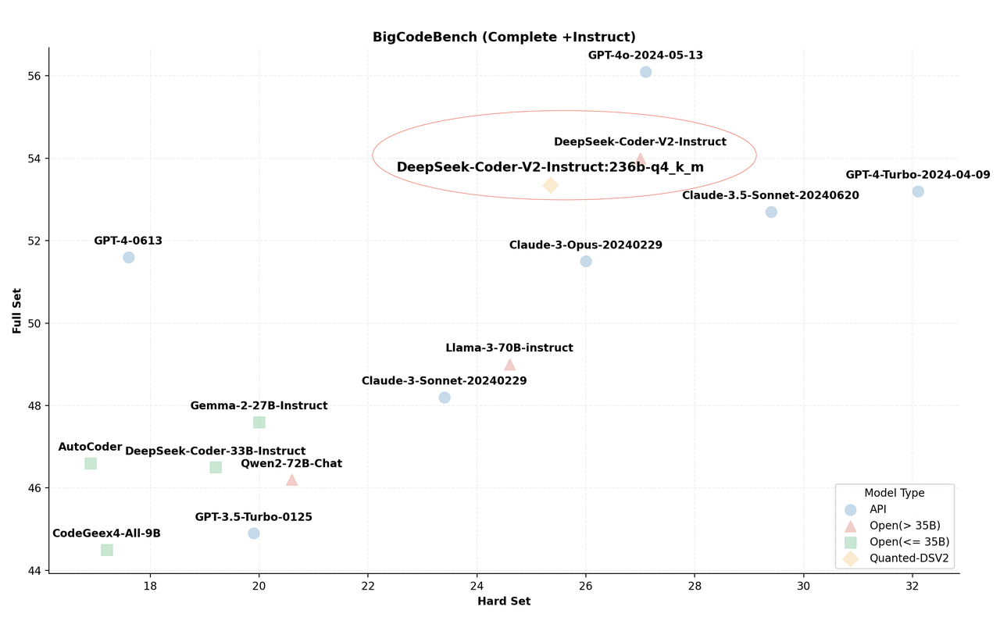
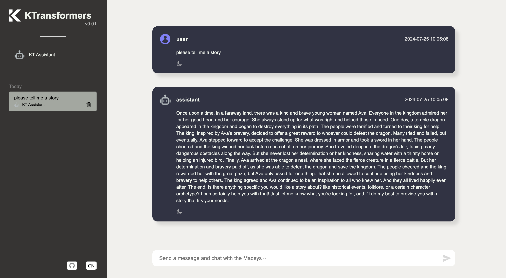
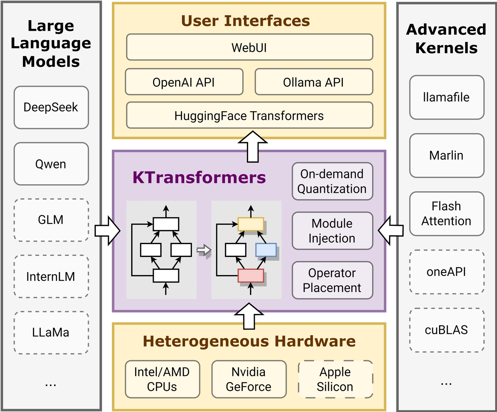

<div align="center">
  <!-- <h1>KTransformers</h1> -->
  <p align="center">
  <picture>
    
  </picture>
  </p>
  <h3>A Flexible Framework for Experiencing Cutting-edge LLM Inference Optimizations</h3>
  <strong><a href="#show-cases">🔥 Show Cases</a> | <a href="#quick-start">🚀 Quick Start</a> | <a href="#tutorial">📃 Tutorial</a></strong>
</div>


<h2 id="intro">🎉 Introduction</h2>
KTransformers, pronounced as Quick Transformers, is designed to enhance your 🤗 <a href="https://github.com/huggingface/transformers">Transformers</a> experience with advanced kernel optimizations and placement/parallelism strategies.
<br/><br/>
KTransformers is a flexible, Python-centric framework designed with extensibility at its core. 
By implementing and injecting an optimized module with a single line of code, users gain access to a Transformers-compatible
interface, RESTful APIs compliant with OpenAI and Ollama, and even a simplified ChatGPT-like web UI. 
<br/><br/>
Our vision for KTransformers is to serve as a flexible platform for experimenting with innovative LLM inference optimizations. Please let us know if you need any other features.


<h2 id="show-cases">🔥 Show Cases</h2>
<h3>GPT-4-level Local VSCode Copilot on a Desktop with only 24GB VRAM</h3>
<p align="center">

  https://github.com/user-attachments/assets/3f85780e-aa53-4d2f-91b2-5585c8dade85

</p>

- **Local 236B DeepSeek-Coder-V2:** Running its Q4_K_M version using only 21GB VRAM and 136GB DRAM, attainable on a local desktop machine, which scores even better than GPT4-0613 in [BigCodeBench](https://huggingface.co/blog/leaderboard-bigcodebench).

<p align="center">
  <picture>
    
  </picture>
</p>

- **Faster Speed:** Achieving 126 tokens/s for 2K prompt prefill and 13.6 tokens/s for generation through MoE offloading and injecting advanced kernels from [Llamafile](https://github.com/Mozilla-Ocho/llamafile/tree/main) and [Marlin](https://github.com/IST-DASLab/marlin).
- **VSCode Integration:** Wrapped into an OpenAI and Ollama compatible API for seamless integration as a backend for [Tabby](https://github.com/TabbyML/tabby) and various other frontends.

<p align="center">
  <!--  -->

  http://video.approaching-ai.com/ktransformers-tabby.mp4
  
</p>


<strong>More advanced features will coming soon, so stay tuned!</strong>

<h2 id="quick-start">🚀 Quick Start</h2>
<h3>Install</h3>
Requirements:

- [CUDA](https://developer.nvidia.com/cuda-toolkit-archive) 12.2 and above with setting enviroment
  ```
  export PATH=/usr/local/cuda/bin:$PATH
  export LD_LIBRARY_PATH=/usr/local/cuda/lib64:$LD_LIBRARY_PATH
  export CUDA_PATH=/usr/local/cuda
  ```
- Linux-x86_64 with gcc, g++ and cmake
  ```sh
  sudo apt-get install gcc g++ cmake
  ```
- We recommend using [Conda](https://repo.anaconda.com/miniconda/Miniconda3-latest-Linux-x86_64.sh) to create a virtual environment with Python=3.11 to run our program.
  ```sh
  conda create --name {your_env_name} python=3.11
  conda activate {your_env_name} 
  ```

- PyTorch 2.3.0 and above
  ```sh
  pip install torch
  ```

Install KTransformers

- Install ktransformers with [pip package](http://):
  ```sh
  pip install ktransformers-0.1.0.tar.gz
  ```
  or from source (If you want to run with website, please [compile the website](./doc/en/api/server/website.md) first after git clone the repo.):
  ```sh
  git clone https://github.com/kvcache-ai/ktransformers.git
  cd ktransformers
  git submodule init
  git submodule update
  pip install .
  ```

<h3>Local Chat</h3>
After installation, we provide a simple command-line local chat Python script that you can run for testing:

```shell
python -m  ktransformers.local_chat --model_path deepseek-ai/DeepSeek-V2-Chat --gguf_path /path/to/DeepSeek-V2-Chat.q4_k_m.gguf/
```

It features the following arguments:

- model_path (required): name (such as "deepseek-ai/DeepSeek-V2-Chat" which will auto downloaded from [Hugging Face](https://huggingface.co/deepseek-ai/DeepSeek-Coder-V2-Instruct)) or local path of transformers will use to initialize the model.  Attention: <strong>No safetensors</strong> are required in the directory.
- gguf_path (required): Path of a directory containing GGUF files which could that can be downloaded from [Hugging Face](https://huggingface.co/LoneStriker/DeepSeek-Coder-V2-Instruct-GGUF/tree/main) (we only support q4_k_m just now)
- optimize_rule_path (required except for Qwen2Moe and DeepSeek-V2): Path of YAML file containing optimize rules.There are two rule files pre-written in the [ktransformers/optimize/optimize_rules](ktransformers/optimize/optimize_rules) directory for optimizing DeepSeek-V2 and Qwen2-57B-A14, two SOTA MoE models.
- max_new_tokens: Int (default=1000). Max new tokens to generate.
- cpu_infer: Int (default=10). The number of CPUs used for inference, should ideally be set to the (total number of cores - 2).

<h3>RESTful API and Web UI</h3>
Start without website:

```sh
ktransformers --model_path deepseek-ai/DeepSeek-V2-Chat --gguf_path /path/to/DeepSeek-V2-Chat.q4_k_m.gguf/ --port 10002
```
Start with website:
```sh
ktransformers --model_path deepseek-ai/DeepSeek-V2-Chat --gguf_path /path/to/DeepSeek-V2-Chat.q4_k_m.gguf/  --port 10002 --web True
```
Or you want to start server with transformers, the model_path should include safetensors
```bash
ktransformers --type transformers --model_path /mnt/data/model/Qwen2-0.5B-Instruct --port 10002 --web True
```

Aceess Website with url [http://localhost:10002/web/index.html#/chat](http://localhost:10002/web/index.html#/chat) :

<p align="center">
  <picture>
    
  </picture>
</p>

More information about the RESTful API server can be found [here](doc/en/api/server/server.md). You can also find an example of integrating with Tabby [here](doc/en/api/server/tabby.md).


<h2 id="tutorial">📃 Brief Injection Tutorial</h2>
At the heart of KTransformers is a user-friendly, template-based injection framework. 
This allows researchers to easily replace original torch modules with optimized variants. It also simplifies the process of combining multiple optimizations, allowing the exploration of their synergistic effects. 

</br>
<p align="center">
  <picture>
    
  </picture>
</p>

Given that vLLM already serves as a great framework for large-scale deployment optimizations, KTransformers is particularly focused on local deployments that are constrained by limited resources. We pay special attention to heterogeneous computing opportunities, such as GPU/CPU offloading of quantized models. For example, we support the efficient <a herf="https://github.com/Mozilla-Ocho/llamafile/tree/main">Llamafile</a> and <a herf="https://github.com/IST-DASLab/marlin">Marlin</a> kernels for CPU and GPU, respectively. More details can be found <a herf="doc/en/operators/llamafile.md">here</a>.

<h3>Example Usage</h3>
To utilize the provided kernels, users only need to create a YAML-based injection template and add the call to `optimize_and_load_gguf` before using the Transformers model.

```python
with torch.device("meta"):
    model = AutoModelForCausalLM.from_config(config, trust_remote_code=True)
optimize_and_load_gguf(model, optimize_rule_path, gguf_path, config)
...
generated = prefill_and_generate(model, tokenizer, input_tensor.cuda(), max_new_tokens=1000)
```

In this example, the AutoModel is first initialized on the meta device to avoid occupying any memory resources. Then, `optimize_and_load_gguf` iterates through all sub-modules of the model, matches rules specified in your YAML rule file, and replaces them with advanced modules as specified.

After injection, the original `generate` interface is available, but we also provide a compatible `prefill_and_generate` method, which enables further optimizations like CUDAGraph to improve generation speed.

<h3>YAML Template</h3>
Below is an example of a YAML template for replacing all original Linear modules with Marlin, an advanced 4-bit quantization kernel.

```yaml
- match:
    name: "^model\\.layers\\..*$"  # regular expression 
    class: torch.nn.Linear  # only match modules matching name and class simultaneously
  replace:
    class: ktransformers.operators.linear.KTransformerLinear  # optimized Kernel on quantized data types
    kwargs:
      generate_linear_type: "QuantizedLinearMarlin"
```

Each rule in the YAML file has two parts: `match` and `replace`. The `match` part specifies which module should be replaced, and the `replace` part specifies the module to be injected into the model along with the initialization keywords.

You can find example rule templates for optimizing DeepSeek-V2 and Qwen2-57B-A14, two SOTA MoE models, in the [ktransformers/optimize/optimize_rules](ktransformers/optimize/optimize_rules) directory. These templates are used to power the `local_chat.py` demo.

A detailed description of the injection using DeepSeek-V2 as an example is given [here](doc/en/deepseek-v2-injection.md).

<h2 id="ack">Acknowledgment and Contributors</h2>

The development of KTransformer is based on the flexible and versatile framework provided by Transformers. We also benefit from advanced kernels such as GGUF/GGML, Llamafile, and Marlin. We are planning to contribute back to the community by upstreaming our modifications.

KTransformer is actively maintained and developed by contributors from the <a href="https://madsys.cs.tsinghua.edu.cn/">MADSys group</a> at Tsinghua University and members from <a href="http://approching.ai/">Approaching.AI</a>. We welcome new contributors to join us in making KTransformer faster and easier to use.
