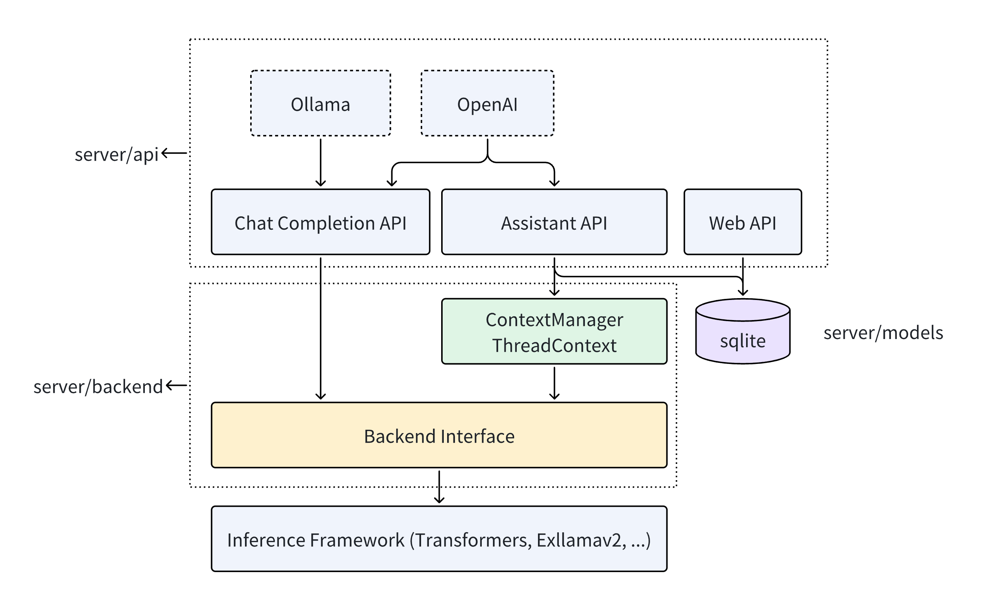

# Server
## 总览



Server对外提供兼容 [OpenAI Assistant](https://platform.openai.com/docs/api-reference/assistants/createAssistant) 和 [Ollama](https://github.com/ollama/ollama/blob/main/docs/api.md) 的 RESTful API，对内对接ktransformers, [transformers](https://huggingface.co/docs/transformers/index) 和 [exllamav2](https://github.com/turboderp/exllamav2)等推理框架。
Server使用的 Python [FastAPI](https://fastapi.tiangolo.com/)构建异步的 RESTful API，使用pydantic构建内存数据结构，并使用 sqlalchemy 对接 sqlite 数据库。

Server 的项目目录结构如下：

``` bash
server/
├── api
├── backend
├── config
├── crud
├── models
├── schemas
└── utils
```

Server在 `server/api` 中提供 WebAPI，为 UI 提供Server服务。和模型推理相关的接口有 Completion API，和 Assistant API。
- Completion API 要求用户提供所有历史对话，传给 LLM 后将补全的结果返回给用户。
- Assistant API 可以将用户和 LLM 的对话以 Message 的形式存储在 Thread 中，并以 Run 的形式调用 LLM 进行推理。
Completion API 比较简单，服务器不会存储状态，一次 LLM 推理只有一次 API 调用。Assistant API 更为复杂，会在服务器中存储用户的状态，一次推理涉及多次 API 调用。

Server 通过定义在 `server/backend` 中的 BackendInterface 调用推理框架。对于每个 BackendInterface，都需要实现 work 函数。work 函数的参数包括对话信息 `local_messages` ，返回一个输出推理结果的 async stream。Completion API 可以直接调用 Interface 的 work 函数实现功能。
``` python    
class MyBackend(BackendInterfaceBase):
    async def work(self, local_messages, request_unique_id: Optional[str])->AsyncIterator[str]:
        # implementations
```


为了实现 Assistant 的相关功能，Server 在 `server/schemas` 里定义了 pydantic object，通过`server/crud` 中的 CRUD 函数操作数据，并在 `server/models` 里通过 ORM 和 sqlite 数据库进行同步。此外，Server 还需要实现一个 ThreadContext，以和 BackendInterface 进行对接。get_local_messages是需要实现的函数，其主要功能是将存储在 Thread 中的对话信息提取出来，并格式化成 BackendInterface 能够接受的形式。具体的逻辑请参考 `server/backend/base.py`。

```python
class MyThreadContext(ThreadContext):
    def get_local_messages(self):
        '''
        Get local messages, as the input to interface.work
        This function is intended to message preprocess e.g. apply chat template
        '''
        # implmentations
```

本项目已经对接好 transformers，请参考 `server/backend/interfaces/transformers.py`。 


## 部署与启动

在 `ktransformers/configs/config.yaml` 中配置Server的启动参数
