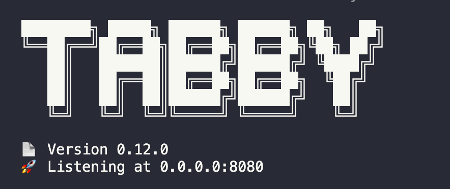
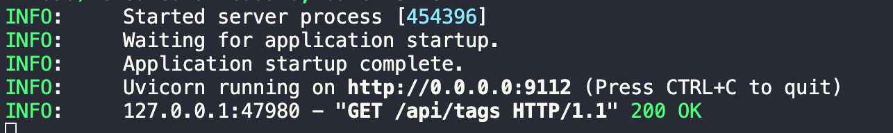

# 如何使用 Tabby 和ktransformers 在本地做代码补全？

[Tabby](https://tabby.tabbyml.com/docs/welcome/) 是一个开源的代码助手，用户可以自己配置，并可以在多个 IDE/编辑器上使用，例如 VSCode和 InteliJ。因为 Tabby 在框架侧可以对接到Ollama，并且 ktransformers server 提供和 Ollama 一致的 API 接口，所以我们可以将 Tabby 对接到 ktransformers server。并在代码补全的场景中体验到 ktransformers 快速的异构推理。

1. 启动 ktransformers。
```bash
./ktransformers --port 9112
```
2. 安装 Tabby：按照Tabby 的官方教程在带有英伟达 GPU 的 Linux 服务器或者 Windows PC上[安装 Tabby](https://tabby.tabbyml.com/docs/quick-start/installation/linux/)。
3. 配置 Tabby：创建`~/.tabby/config.toml`，并加入以下配置。这个配置的意味着 ktransformers 假装是 Ollama 为Tabby 提供模型接口。`prompt_template`是模型的提示词模板，使用对应的模版才能利用模型的 Fill In the Middle 的功能。
```toml
[model.completion.http]
kind = "ollama/completion"
api_endpoint = "http://127.0.0.1:9112/v1/"
model_name = "DeepSeek-Coder-V2-Instruct"
prompt_template = "<｜fim▁begin｜>{prefix}<｜fim▁hole｜>{suffix}<｜fim▁end｜>" # Prompt Template
```
4. 启动 Tabby 服务：`./tabby serve`。


​	启动之后，期望会在 ktransformers 的命令行界面看到对`/api/tags`接口的访问。


6. 注册 Tabby 账户，获取 Token，参照[这里](https://tabby.tabbyml.com/docs/quick-start/register-account/)

7. 启动 VScode 安装 Tabby 拓展插件，使用上一步获得的 Token 连接 Tabby Server，参照[这里](https://tabby.tabbyml.com/docs/extensions/installation/vscode/)。

8. 打开任意代码文件，体验 ktransformers 的快速异构推理。

