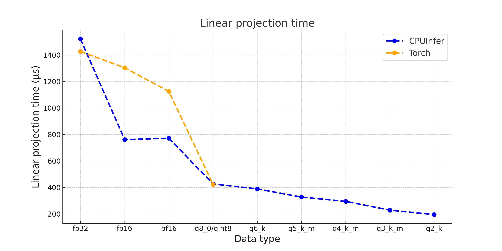
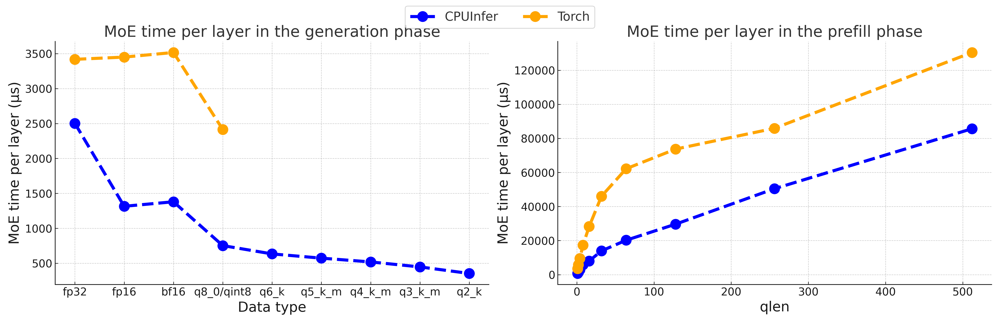

# Llamafile Operators Documentation

## Llamafile Sgemm
The llamafile sgemm module is a core component for implementing general matrix multiplication (GEMM). This module optimizes performance by using various processor-specific instruction sets. For example, it includes checks for different x86 instruction sets such as AVX, FMA, and AVX512, and leverages these advanced instructions to accelerate computation. Additionally, the llamafile sgemm module supports multiple quantization types, such as q8_0, q6_k, q5_k, among a dozen others. This module aims to adapt to different hardware capabilities, ensuring that it utilizes the most advanced instructions available in a given computing environment, thereby achieving high computational efficiency. You can view the file and its details on [GitHub](https://github.com/Mozilla-Ocho/llamafile/blob/main/llamafile/sgemm.cpp) for more information.

## CPUInfer
CPUInfer is an inference framework optimized for CPUs that leverages the llamafile sgemm module to implement key operators such as linear layers, MLP, and MoE. These operators are fundamental components for building large models. CPUInfer uses a backend work-stealing thread pool and asynchronous task queue execution logic to efficiently offload parts of model parameters to the CPU, thereby maintaining high inference performance. It supports adjustments based on hardware capabilities or user configurations, providing enhanced inference performance and making it an ideal tool for running deep learning models on CPUs.

## Expert-Parallel MoE

The MoE module's performance can be enhanced by using custom kernels that utilize **expert parallelism**. As the routed experts are independently computable, we can utilize this inherent parallelism to speed up MoE computations. In particular, we can allocate each expert MLP to a separate thread group, allowing for the simultaneous computation of all routed experts. This approach of expert parallelism significantly boosts MoE performance by minimizing the frequency of global synchronizations and reducing the kernel launch overhead compared to sequential expert computation.

## Microbenchmark

Our evaluations were conducted on an Intel (R) Xeon (R) Gold 6454S processor, utilizing real parameters from the DeepSeek-Coder-V2-Instruct model.

### Linear Projection

The performance of the linear layer was assessed using an Attention Output Projection with dimensions of [5120, 16384]. Here, the input was a vector of 16384 dimensions, and the output was a vector of 5120 dimensions.

In half-precision floating-point formats (fp16 and bf16), CPUInfer's performance exceeded that of Torch by 1.7 and 1.5 times, respectively. For 8-bit quantization, CPUInfer (supporting q8_0) and Torch (supporting qint8) demonstrated nearly equivalent performance. However, CPUInfer employs a more refined scaling approach, using different factors for each group (in q8_0 quantization, every 32 numbers form one group), whereas Torch uses a basic per-tensor quantization, potentially leading to significant precision loss. Furthermore, CPUInfer’s capability to use lower-bit quantization enhances inference speed in specific scenarios.

### MoE

In MoE module, each token selected 6 experts out of 160 for computation, with input and output dimensions of 5120, and an intermediate dimension of 1536.

For half-precision floating points and 8-bit quantization formats, CPUInfer’s generation performance was 2.5 and 3.2 times better than Torch, respectively. Moreover, using the 8-bit quantization format, CPUInfer achieved faster prefill speeds compared to Torch, with shorter prompts highlighting a more pronounced performance difference.